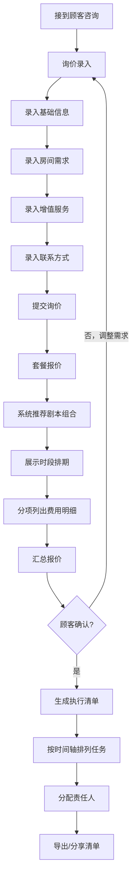

## 1. 产品概述

剧本杀门店生日包场接待工具——专为剧本杀门店店长与店员设计的桌面端接待工具，重点解决顾客咨询多、需求杂、报价容易漏项的痛点。通过三窗口流程化操作，将"询价录入→套餐报价→执行清单"串联为一条清晰的服务链路，让前台、DM 和后勤按同一份单子高效协作。

- 目标用户：剧本杀门店店长、前台接待、DM
- 核心价值：减少报价遗漏、提升接待效率、确保执行环节零遗漏

## 2. 核心功能

### 2.1 用户角色

| 角色 | 使用方式 | 核心权限 |
|------|----------|----------|
| 店长 | 主操作者 | 全部功能，含门店配置与数据管理 |
| 前台接待 | 日常操作 | 询价录入、套餐报价、执行清单查看 |
| DM | 协作查看 | 查看执行清单中分配给自己的任务 |

### 2.2 功能模块

1. **询价录入窗口**：逐步引导录入顾客需求信息
2. **套餐报价窗口**：智能匹配剧本组合，分项展示费用明细
3. **执行清单窗口**：生成当日任务清单，分配责任人与时间节点

### 2.3 页面详情

| 页面名称 | 模块名称 | 功能描述 |
|----------|----------|----------|
| 询价录入 | 基础信息区 | 录入生日人数、主宾年龄段、到店日期与时段 |
| 询价录入 | 房间需求区 | 是否需要独立房间、房间类型偏好 |
| 询价录入 | 增值服务区 | 是否带酒水/蛋糕、是否需要DM主持生日环节、特殊备注 |
| 询价录入 | 顾客联系方式 | 姓名、电话/微信，方便后续跟进 |
| 套餐报价 | 剧本推荐区 | 根据人数、年龄段和房间容量筛选适合的剧本列表，展示剧本名称、类型、人数范围、时长 |
| 套餐报价 | 时段排期区 | 展示可选时段，标注已占用/空闲状态 |
| 套餐报价 | 费用明细区 | 分项列出：基础场费、生日布置费、蛋糕代收费、酒水服务费、加时费、DM主持费等 |
| 套餐报价 | 套餐总价区 | 自动汇总各项费用，支持手动调整折扣 |
| 执行清单 | 时间轴区 | 按时间倒序排列当日所有任务节点（提前布置→顾客到店→开本→切蛋糕→合照→散场） |
| 执行清单 | 人员分配区 | 每个任务节点分配责任人（前台/DM/后勤） |
| 执行清单 | 清单导出区 | 支持打印或截图分享，方便团队协作 |

## 3. 核心流程

店员接到电话或微信咨询后，进入"询价录入"窗口，按步骤填写生日人数、年龄段、到店时间、房间需求、酒水蛋糕和DM主持需求。提交后系统自动跳转"套餐报价"窗口，根据门店已有剧本、房间容量和时段排期，列出适合包场的剧本组合与分项费用明细。顾客确认方案后，店长点击"生成执行清单"，系统自动生成一份当日执行清单，写明每个环节的负责人与时间节点，方便前台、DM和后勤按同一份单子协作。

## 4. 用户界面设计

### 4.1 设计风格

- **主色调**：深暖灰底色（#1a1a2e）搭配琥珀金强调色（#e2a04a），营造沉浸式"剧本杀"氛围
- **辅助色**：酒红（#c84b31）用于警告/重要提示，薄荷绿（#33b89a）用于确认/成功状态
- **按钮风格**：圆角微立体按钮，带细微阴影与悬停反馈
- **字体**：标题使用"ZCOOL QingKe HuangYou"（站酷庆科黄油体）增强趣味感，正文使用"Noto Sans SC"保证可读性
- **布局风格**：三窗口标签页导航，左侧为主操作区，右侧为实时预览/摘要面板
- **图标风格**：线性图标搭配微填充，风格统一，辨识度高

### 4.2 页面设计概览

| 页面名称 | 模块名称 | UI元素 |
|----------|----------|--------|
| 询价录入 | 基础信息区 | 卡片式布局，数字输入框（人数）、下拉选择（年龄段）、日期时间选择器 |
| 询价录入 | 房间需求区 | 开关切换（独立房间）、房间类型单选卡片 |
| 询价录入 | 增值服务区 | 复选框组（蛋糕/酒水/DM主持）、文本域（特殊备注） |
| 询价录入 | 顾客联系方式 | 输入框组（姓名/电话），右侧实时预览摘要面板 |
| 套餐报价 | 剧本推荐区 | 横向滚动剧本卡片，展示封面缩略图、名称、类型标签、人数区间 |
| 套餐报价 | 时段排期区 | 时间格子网格，绿色空闲/红色占用/黄色候选 |
| 套餐报价 | 费用明细区 | 表格式分项列示，每行含项目名、单价、数量、小计，底部汇总行 |
| 套餐报价 | 套餐总价区 | 大字号总价展示，折扣输入框，确认按钮 |
| 执行清单 | 时间轴区 | 垂直时间轴，每个节点含时间、任务描述、状态标签 |
| 执行清单 | 人员分配区 | 每个节点下拉选择责任人，角色颜色标签 |
| 执行清单 | 清单导出区 | 打印按钮、复制链接按钮 |

### 4.3 响应式设计

- 桌面优先设计，最低支持 1280×720 分辨率
- 主区域最小宽度 960px，侧边预览面板可折叠
- 不做移动端适配（桌面端专用工具）

### 4.4 3D 场景

不适用
