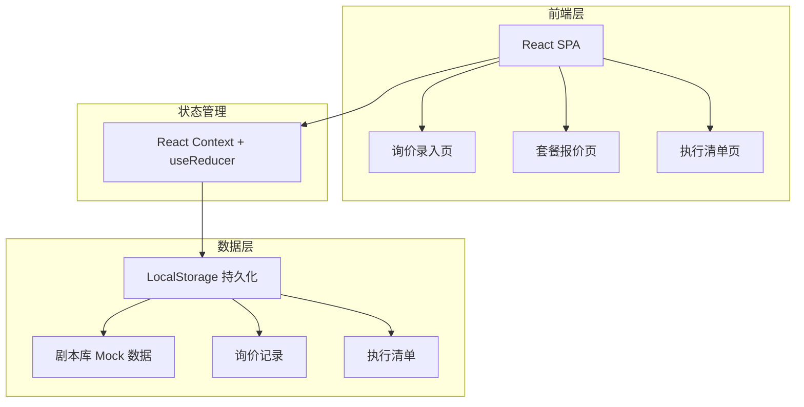
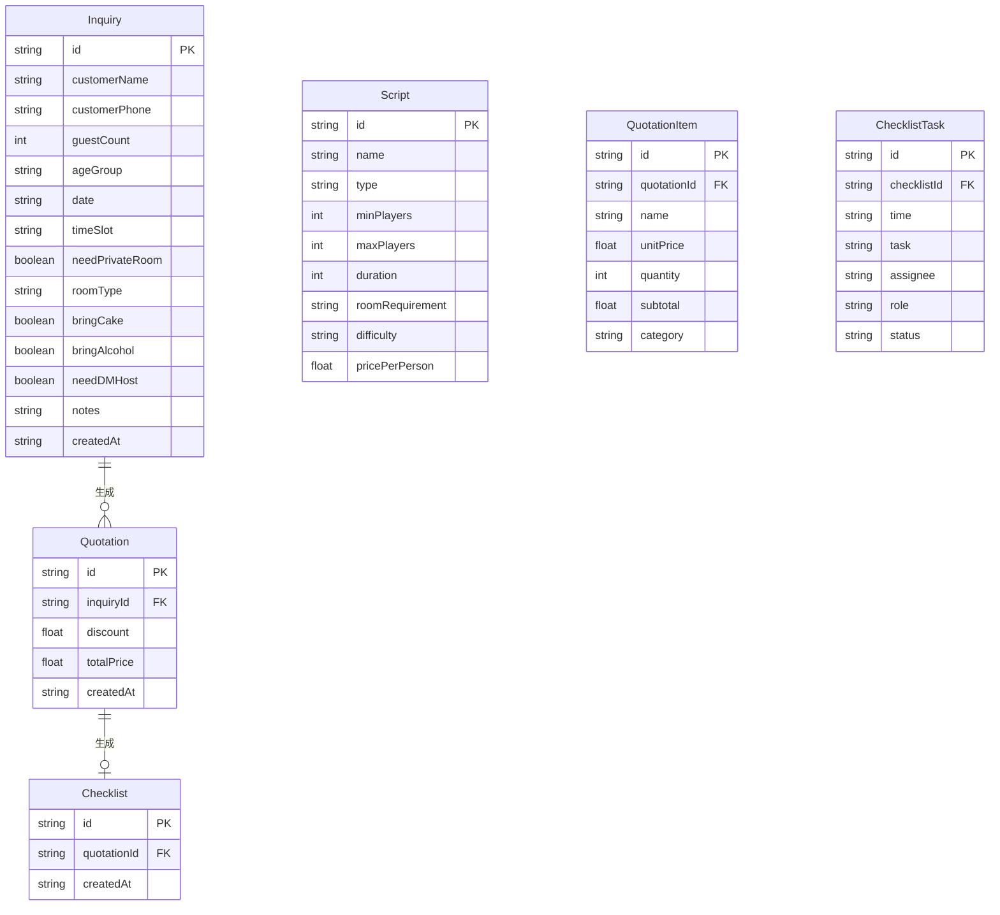

## 1. 架构设计



## 2. 技术说明

- **前端**：React@18 + Tailwind CSS@3 + Vite
- **初始化工具**：Vite (React + TypeScript 模板)
- **后端**：无（纯前端应用，数据存储在 LocalStorage）
- **数据库**：无（使用 Mock 数据 + LocalStorage 持久化）
- **状态管理**：React Context + useReducer
- **字体**：Google Fonts（ZCOOL QingKe HuangYou + Noto Sans SC）
- **图标**：内联 SVG 图标

## 3. 路由定义

| 路由 | 用途 |
|------|------|
| / | 应用首页，重定向至 /inquiry |
| /inquiry | 询价录入窗口 |
| /quotation | 套餐报价窗口 |
| /checklist | 执行清单窗口 |

## 4. API 定义

无后端 API，所有数据通过 LocalStorage 读写。

### 4.1 数据接口定义

```typescript
interface InquiryData {
  id: string;
  customerName: string;
  customerPhone: string;
  guestCount: number;
  ageGroup: 'child' | 'teen' | 'adult' | 'mixed';
  date: string;
  timeSlot: string;
  needPrivateRoom: boolean;
  roomType?: 'small' | 'medium' | 'large';
  bringCake: boolean;
  bringAlcohol: boolean;
  needDMHost: boolean;
  notes: string;
  createdAt: string;
}

interface Script {
  id: string;
  name: string;
  type: 'joy' | 'emotion' | 'terror' | 'reasoning' | 'mechanism';
  minPlayers: number;
  maxPlayers: number;
  duration: number;
  roomRequirement: 'small' | 'medium' | 'large';
  difficulty: 'easy' | 'medium' | 'hard';
  pricePerPerson: number;
}

interface QuotationItem {
  name: string;
  unitPrice: number;
  quantity: number;
  subtotal: number;
  category: 'base' | 'decoration' | 'cake' | 'alcohol' | 'overtime' | 'dm' | 'other';
}

interface QuotationData {
  id: string;
  inquiryId: string;
  selectedScripts: Script[];
  timeSlot: string;
  items: QuotationItem[];
  discount: number;
  totalPrice: number;
  createdAt: string;
}

interface ChecklistTask {
  id: string;
  time: string;
  task: string;
  assignee: string;
  role: 'front_desk' | 'dm' | 'logistics';
  status: 'pending' | 'in_progress' | 'done';
}

interface ChecklistData {
  id: string;
  quotationId: string;
  tasks: ChecklistTask[];
  createdAt: string;
}
```

## 5. 服务端架构

不适用（纯前端应用）

## 6. 数据模型

### 6.1 数据模型定义



### 6.2 数据初始化

应用内置 8-10 条剧本 Mock 数据，涵盖不同类型（欢乐、情感、恐怖、推理、机制）和人数区间，确保报价推荐功能可演示。门店配置（房间数量、时段、加时费率等）同样以 Mock 数据初始化。
